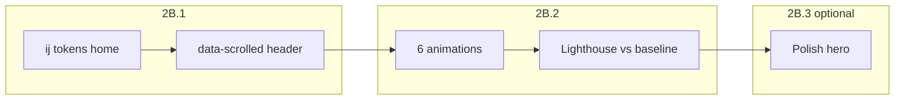

# Phase 2B — Home (`/`) : plan détaillé

> **Statut** : plan uniquement — pas d’implémentation tant que le feu vert explicite n’est pas donné.  
> **Contexte** : Phase 2A close (header/footer/wordmark `ij.*`, e2e, hystérésis scroll, hook graphify UTF-8).  
> **Rappel** : `LIGHT_MODE_ENABLED = false` dans [`src/components/providers/ThemeProvider.tsx`](../../src/components/providers/ThemeProvider.tsx) — le rendu pertinent pour la home et Lighthouse reste **dark verrouillé**.

---

## 1. Arborescence `src/components/home/`

**10 fichiers** au total (TS/TSX). Comptage des **lignes** = nombre de lignes physiques du fichier (incl. vides, fin de fichier).

| Fichier | Lignes | Rôle fonctionnel (vitrine) |
|--------|--------|----------------------------|
| [`sections/hero-section.tsx`](../../src/components/home/sections/hero-section.tsx) | 461 | **Hero** : accroche, quiz intégré, CTA principal / secondaire, stats inline, fond décoratif — **zone LCP prioritaire**. |
| [`sections/home-refonte-sections.tsx`](../../src/components/home/sections/home-refonte-sections.tsx) | 804 | **Bloc monolithique** : parcours « par où commencer », enquêtes, épreuves, **profils d’usage**, **pricing**, **programme complet** (grille) ; exports « infractions / fondamentaux » aperçu **non montés** sur `/` (voir §1.2). **Pas de section FAQ dédiée** dans ce fichier (accordéons = aperçu infractions). |
| [`hydration-safe-day-counts.tsx`](../../src/components/home/hydration-safe-day-counts.tsx) | 112 | **Compteurs / badge session** (hydratation client, évite mismatch). |
| [`sections/home-journey-strip.tsx`](../../src/components/home/sections/home-journey-strip.tsx) | 158 | **Strip parcours** : timeline « Apprendre → S’entraîner → Premium ». |
| [`sections/home-stats-section.tsx`](../../src/components/home/sections/home-stats-section.tsx) | 102 | **Section stats** : les 3 grands chiffres clés sous le hero. |
| [`AnimatedStat.tsx`](../../src/components/home/AnimatedStat.tsx) | 49 | **Présentation d’un chiffre** (composant réutilisable ; variantes light/dark). |
| [`home-page-client.tsx`](../../src/components/home/home-page-client.tsx) | 49 | **Composition** : enchaîne les sections de la home. |
| [`hero-quiz-data.ts`](../../src/components/home/hero-quiz-data.ts) | 53 | **Données** du mini-quiz hero (pas de styles). |
| [`motion.ts`](../../src/components/home/motion.ts) | 9 | **Constantes motion** (easing, réglages SEO/motion). |
| [`home-fascicule-types.ts`](../../src/components/home/home-fascicule-types.ts) | 10 | **Types** infraction preview (pas de styles). |

### 1.1 Décompte grep (cible migration **2B.1**)

Occurrences **par fichier** pour : `slate-*`, `examen-*`, `ds.*` (mot `\bds.`), `bg-white` (mot entier, inclut `bg-white/…`), `text-white` (idem), `bg-gradient-*`.

| Fichier | `slate-` | `examen-` | `ds.` | `bg-white` | `text-white` | `bg-gradient-` |
|---------|----------|-----------|-------|------------|--------------|----------------|
| `AnimatedStat.tsx` | 1 | 1 | 0 | 1 | 1 | 0 |
| `hero-quiz-data.ts` | 0 | 0 | 0 | 0 | 0 | 0 |
| `home-fascicule-types.ts` | 0 | 0 | 0 | 0 | 0 | 0 |
| `home-page-client.tsx` | 0 | 0 | 0 | 0 | 0 | 0 |
| `hydration-safe-day-counts.tsx` | 0 | 9 | 0 | 0 | 0 | 0 |
| `motion.ts` | 0 | 0 | 0 | 0 | 0 | 0 |
| `sections/hero-section.tsx` | 22 | 0 | 0 | 8 | 11 | 8 |
| `sections/home-journey-strip.tsx` | 5 | 0 | 0 | 3 | 5 | 4 |
| `sections/home-refonte-sections.tsx` | 23 | 33 | 0 | 16 | 21 | 13 |
| `sections/home-stats-section.tsx` | 1 | 0 | 0 | 3 | 0 | 2 |
| **Total** | **52** | **43** | **0** | **31** | **38** | **27** |

**Notes**

- **`ds.*`** : aucune occurrence dans `src/components/home/` au scan actuel.
- **Namespaces legacy hors liste** : **`orde-*`** présent **4** fois (`home-refonte-sections.tsx` ×3, `AnimatedStat.tsx` ×1) — à traiter en même temps que la migration (équivalents `ij.*` ou neutres).
- **`examen-*`** concentré dans `hydration-safe-day-counts.tsx` et `home-refonte-sections.tsx` (+1 libellé dans `AnimatedStat.tsx`).

### 1.2 Cartographie [`home-refonte-sections.tsx`](../../src/components/home/sections/home-refonte-sections.tsx) (rapport grep **2B.1b**)

Plages de lignes (fichier au **2026-04-19**, commit courant). **Pas de refactor** en 2B : carte pour une **Phase 3** éventuelle (décomposition).

| Plage | Export / zone | Rôle (alias métier) | Monté sur `/` via [`home-page-client.tsx`](../../src/components/home/home-page-client.tsx) |
|-------|----------------|---------------------|-------------------------------------------------------------------------------------------|
| **39–146** | `StartHereSection` | **Parcours / « par où commencer »** (3 cartes — cible du *stagger diagnostic* en 2B.2) | Oui (`<StartHereSection />`) |
| **149–248** | `HomeEnquetesPillarSection` | **Enquêtes** (pilier + cartes ENQUETES) | Oui |
| **251–344** | `HomeEpreuvesLandingSection` | **Épreuves** (3 cartes + lien hub) | Oui |
| **347–395** | `HomeInfractionsPreviewSection` | **Aperçu infractions** (accordéon Épreuve 1) | **Non** (export orphelin ; doublon fonctionnel avec partie « programme ») |
| **397–448** | `FOND_BLOCS` + `HomeFondamentauxPreviewSection` | **Aperçu fondamentaux** (grille 6 blocs) | **Non** (export orphelin) |
| **451–478** | `TerrainOriginSection` | **Terrain / transparence** (texte rédactionnel + encadré) | Oui |
| **488–571** | `HomeTestimonialsSection` | **Profils d’usage** (ex-zone « témoignages » ; cartes citations fictives) | Oui (dynamic import) |
| **574–681** | `HomeFinalPricingSection` | **Pricing** (J-X, 2 colonnes Gratuit / Premium, CTA) | Oui (dynamic import) |
| **683–803** | `HomeProgrammeCompletSection` | **Programme complet** (grille 2 colonnes : infractions + fondamentaux) | Oui (dynamic import) |
| — | *FAQ* | — | **Aucune section FAQ** nommée dans ce fichier. |

**Ordre réel sur `/`** : `Hero` → `HomeJourneyStrip` → `HomeStats` → `StartHere` → `TerrainOrigin` → `HomeEnquetes` → `HomeEpreuves` → `HomeTestimonials` → `HomeFinalPricing` → `HomeProgrammeComplet`.

### 1.3 Exports orphelins — traitement Phase 2B (**option B**)

**Décision** : ne **ni migrer** (option A) **ni supprimer** (option C) les blocs **`HomeInfractionsPreviewSection`** (L347–395) et **`HomeFondamentauxPreviewSection`** (L397–448) dans [`home-refonte-sections.tsx`](../../src/components/home/sections/home-refonte-sections.tsx) pendant **2B.1b**.

- Chaque export porte un bloc JSDoc **`@deprecated`** (composant non monté sur `/` au **2026-04-19**, tokens legacy conservés, **Phase 3** : migrer ou supprimer lors de la décomposition du fichier).
- Les occurrences **`slate-*`**, **`examen-*`**, **`bg-white`**, **`text-white`**, **`bg-gradient-*`** **à l’intérieur de ces deux blocs uniquement** sont **hors périmètre** de la migration **2B.1b**.
- Le **rapport grep** de **2B.1b** doit comporter deux parties :
  1. **Migré** : reste du fichier hors plages orphelines.
  2. **Orphelin, non migré, TODO Phase 3** : décompte isolé pour L347–395 et L397–448 (mêmes motifs que §1.1).

---

## 2. Liste fermée — **6 animations** (vague **2B.2** uniquement)

Aucun ajout ni substitution en cours de route. Chaque animation doit respecter **`prefers-reduced-motion`** (fallback : état final statique ou transition minimale).

1. **Pastille pulsante** — badge session **J-X** (compte à rebours / urgence).
2. **Compteur au scroll** — sur les **3 chiffres clés** (`home-stats-section` / stats hero selon implémentation retenue) via **`IntersectionObserver` natif** (pas de lib tierce).
3. **Stagger d’entrée** — cartes **« diagnostic »** (bloc concerné dans `home-refonte-sections.tsx`).
4. **Hover subtil** — réponses **A / B / C / D** du quiz hero.
5. **Reveal progressif** — sections **sous le hero** (`staggerChildren` **0,08** s).
6. **Flèche animée** — au hover du **CTA principal** du hero.

### 2.1 CLS — compteurs des **3 chiffres clés** (2B.2, animation n°2)

- **Typographie** : `font-variant-numeric: tabular-nums` — en Tailwind : classe **`tabular-nums`** sur le nœud qui affiche le chiffre (ou le parent du triplet si cohérent).
- **Largeur réservée** : conteneur avec **`min-w-[…ch]`** (nombre de caractères de la valeur **finale** formatée, ex. `min-w-[4ch]`) **ou** largeur fixe dérivée du design (éviter tout saut horizontal pendant le comptage).
- **Comportement d’animation (spécification retenue)** : **comptage numérique de 0 → valeur finale** sur une courte durée après déclenchement par `IntersectionObserver` (pas de tick bruité type RNG ; easing lisible). **Pas** de simple fade-in de la valeur finale seule : l’effet « compteur » est explicite ; si `prefers-reduced-motion`, afficher **directement la valeur finale** sans interpolation (voir §6.2).

---

## 3. Lighthouse — **double baseline** + thème dark + règles de comparaison

### 3.1 Fichiers versionnés (deux mesures obligatoires)

| Fichier | Moment de capture | Rôle |
|---------|-------------------|------|
| [`docs/baselines/phase-2b/lighthouse-before-2b.json`](../baselines/phase-2b/lighthouse-before-2b.json) | **Avant toute implémentation 2B.1** — état **post-2A** actuel | Référence « vérité terrain » initiale |
| [`docs/baselines/phase-2b/lighthouse-after-2b1.json`](../baselines/phase-2b/lighthouse-after-2b1.json) | **Après merge / commit final de la vague 2B.1** (tokens + `data-scrolled`, sans animations 2B.2) | Référence **pré-animation** |

Chaque fichier contient **`desktop`** et **`mobile`** avec les métriques ci-dessous.

### 3.2 Règles de non-régression **LCP** (+10 % max)

1. **2B.2 vs 2B.1** (contrôle principal) : après le dernier commit **2B.2**, comparer le Lighthouse **post-2B.2** à **`lighthouse-after-2b1.json`**. Pour **desktop** et **mobile** :  
   `lcp_2b2 ≤ lcp_after2b1 × 1,10`  
   Si dépassement → **pas de merge** ; optimiser puis remesurer.

2. **2B.1 vs post-2A** (régression « silencieuse » migration tokens) : comparer **`lighthouse-after-2b1.json`** à **`lighthouse-before-2b.json`**. Même seuil **±10 %** sur **LCP** en alerte (investigation obligatoire si dégradation ; pas nécessairement blocage si justification perf acceptable et CLS/TBT stables — **décision humaine** documentée dans le corps du commit 2B.1).

### 3.3 Conditions de mesure (équivalent Lighthouse CI « standard »)

- **URL** : `/` (`http://127.0.0.1:3000/` ou preview identique).
- **Build** : `npm run build` puis `npm run start` (pas `dev`).
- **Throttling** : profils Lighthouse par défaut (**Slow 4G**, **CPU 4× slowdown** simulés).
- **Form factors** : exécuter **desktop** et **mobile** (flag `--preset=desktop` vs viewport mobile Lighthouse, ou deux commandes distinctes consolidées dans le JSON).

### 3.4 Forçage **dark** — mécanisme réel du projet (confirmation)

- **Tailwind** : `darkMode: 'class'` dans [`tailwind.config.ts`](../../tailwind.config.ts) — les variantes `dark:` et les tokens **`ij.*`** dépendent de la **classe** `dark` sur un ancêtre (en pratique `<html>`).
- **Layout** : [`src/app/layout.tsx`](../../src/app/layout.tsx) applique **`className={cn('dark', …)}`** sur `<html>` et un script inline **force** `document.documentElement.classList.add('dark')` avant hydratation.
- **Conséquence pour Lighthouse** : la mesure est déjà **dark par contenu**, **sans** s’appuyer sur `prefers-color-scheme` du navigateur pour les tokens. **Pas d’obligation** d’émettre `Sec-CH-Prefers-Color-Scheme: dark` ni `emulateMedia('prefers-color-scheme', 'dark')` **tant que** cette architecture reste inchangée.
- **Si** à l’avenir une partie du CSS ou des médias reposait sur **`prefers-color-scheme`** (ex. après `LIGHT_MODE_ENABLED = true`), alors ajouter dans le runner Lighthouse / Puppeteer :  
  `page.emulateMedia({ colorScheme: 'dark' })` **et/ou** en-têtes client hints équivalents, pour aligner la mesure sur la variante dark.

### 3.5 Métriques à enregistrer (par form factor, dans chaque JSON)

| Champ | Description |
|-------|-------------|
| `performanceScore` | Score perf (0–100) |
| `lcp` | **Largest Contentful Paint** (s) |
| `cls` | **Cumulative Layout Shift** |
| `tbt` | **Total Blocking Time** (ms) |

### 3.6 Schéma JSON (identique pour les deux fichiers, `meta` adapté)

```json
{
  "meta": {
    "url": "http://127.0.0.1:3000/",
    "capturedAt": "ISO-8601",
    "lighthouseVersion": "string",
    "commit": "git-sha",
    "label": "before-2b | after-2b1",
    "darkModeMechanism": "html.classList.contains('dark') + tailwind darkMode:class"
  },
  "desktop": {
    "performanceScore": null,
    "lcp": null,
    "cls": null,
    "tbt": null
  },
  "mobile": {
    "performanceScore": null,
    "lcp": null,
    "cls": null,
    "tbt": null
  }
}
```

Renseigner les valeurs depuis les audits Lighthouse (`largest-contentful-paint`, `cumulative-layout-shift`, `total-blocking-time`, `categories.performance`).

### 3.7 Cahier des charges — [`e2e/header-scroll.spec.ts`](../../e2e/header-scroll.spec.ts)

**Cible** : le nœud `[data-site-header]` (attendu : `data-scrolled="true" | "false"`).

**Prérequis** : `page.goto('/')` ; faire défiler le **viewport document** (`window.scrollTo(0, y)` sur `document.documentElement` / `window`), pas un conteneur scrollable interne arbitraire.

**Scénarios** (à exécuter en **desktop** (viewport par défaut du projet) **et** en **mobile** `375×667` — même suite d’assertions) :

| Étape | Action | Attendu `data-scrolled` |
|-------|--------|-------------------------|
| 1 | `scrollY = 0` (remonter en haut de page) | `"false"` |
| 2 | `scrollY = 60` | `"true"` |
| 3 | `scrollY = 30` (revenir — sous le seuil de **descente** 40) | `"false"` |
| 4a | Depuis l’état **non scrollé** (`false`) : `scrollY = 45` | **`"false"`** (45 ≤ 50 → pas encore « monté ») |
| 4b | Depuis l’état **scrollé** (`true`) : après étape 2, `scrollY = 45` | **`"true"`** (45 > 40 → hystérésis conserve l’état compact) |

**Implémentation Playwright** : `await page.evaluate((y) => window.scrollTo(0, y), value)` puis **attente courte** (`requestAnimationFrame` ou `setTimeout(0)` / `expect.poll`) pour stabiliser le listener `scroll` + `useLayoutEffect`.

**Hors scope** : ne pas tester les classes Tailwind du header — uniquement **`data-scrolled`** et la logique seuil.

---

## 4. Découpage en 3 vagues (1 commit atomique par vague)

### 4.1 **2B.1** — Migration **iso-visuelle** (`ij.*`)

- Remplacer les patterns listés en §1.1 (et `orde-*`) par **`ij.*`**, **`font-ij-display` / `font-ij-sans`** selon hiérarchie, **CTA** : `bg-ij-accent` + `text-ij-bg`.
- **Aucune** nouvelle animation (Framer ou CSS) hors ce qui existe déjà aujourd’hui.
- **Rapport grep** chiffré avant / après sur tout le périmètre touché (minimum : `src/components/home/**`).
- **Attribut `data-scrolled="true" | "false"`** sur l’élément portant déjà **`data-site-header`** (ex. `motion.header`) — synchronisé avec la logique hystérésis existante (**seuil montée 50px**, **descente 40px**).
- **Nouveau fichier e2e** [`e2e/header-scroll.spec.ts`](../../e2e/header-scroll.spec.ts) — cahier des charges **§3.7** (même commit 2B.1 que `data-scrolled`, ou commit atomique suivant si vous préférez séparer).
- **Qualité** : `lint`, `tsc`, `vitest`, `build`, `test:e2e` verts avant commit.

### 4.2 **2B.2** — **6 animations** (§2) uniquement

- Toutes derrière **`prefers-reduced-motion`**.
- Mesure Lighthouse **après** implémentation ; comparer le LCP à **`lighthouse-after-2b1.json`** (règle **+10 %** max, §3.2). Consigner éventuellement un troisième artefact JSON **post-2B.2** dans `docs/baselines/phase-2b/` si utile pour l’historique.
- **Qualité** : même barême qu’en **2B.1**.

### 4.3 **2B.3** (optionnel) — Polish hero

- Uniquement si **2B.2** ne suffit pas visuellement : copy, hiérarchie typographique, spacing — **sans** déraper sur une refonte fonctionnelle non validée.

---

## 5. Périmètre élargi : découpage **2B.a / 2B.b** ?

Il y a **10 fichiers**, mais **`home-refonte-sections.tsx` concentre ~804 lignes** et **~60 % des occurrences** `slate` / `examen` / `white` / `gradient` du dossier `home/`. Un **seul** commit **2B.1** monolithique reste faisable, mais risque :

- revue difficile,
- conflits fréquents,
- rollback lourd.

**Recommandation** : scinder **2B.1** en **deux commits atomiques** (sans changer la numérotation des vagues « officielles » : les deux commits restent la « vague 2B.1 » livrée ensemble ou en enchaînement serré) :

| Lot | Périmètre | Justification |
|-----|-----------|----------------|
| **2B.1a** | `hero-section.tsx`, `home-stats-section.tsx`, `home-journey-strip.tsx`, `AnimatedStat.tsx`, `hydration-safe-day-counts.tsx`, `home-page-client.tsx` (imports si besoin) | **Above-the-fold** + strip parcours + stats : LCP, premier contact visuel, cohérence CTA / tokens. |
| **2B.1b** | `home-refonte-sections.tsx` uniquement | Gros volume de classes + sections multiples ; revue isolée, grep ciblé. |

Fichiers **sans styles** (`hero-quiz-data.ts`, `motion.ts`, `home-fascicule-types.ts`) : touches minimales ou aucune selon imports.

---

## 6. Risques et points de vigilance

### 6.1 **LCP** et animations (**2B.2**)

- Éviter d’ajouter du **travail synchrone** ou des **animations coûteuses** sur l’élément **LCP** (souvent le **hero** : titre, média, ou bloc quiz).
- **Framer Motion** `initial` / `animate` **above-the-fold** : préférer **`animate={false}`** ou CSS léger si le LCP régresse ; reporter motion non essentielle sous le pli.
- Les **compteurs scroll** : démarrer l’animation **après** intersection (pas au `mount` du hero).

### 6.2 **`prefers-reduced-motion`** (par animation)

| # | Animation | Comportement attendu si reduced-motion |
|---|-----------|----------------------------------------|
| 1 | Pastille pulsante | Pas de `pulse` / opacité fixe |
| 2 | Compteur scroll | **Valeur finale immédiate** (pas d’interpolation 0→N) ; pas de durée artificielle |
| 3 | Stagger diagnostic | Apparition instantanée ou opacité 1 sans délai |
| 4 | Hover quiz | États hover limités à couleur/bordure, pas de scale agressif |
| 5 | Reveal sections | `staggerChildren` désactivé ; sections visibles tout de suite |
| 6 | Flèche CTA | Pas de translation animée ; éventuellement saut d’icône statique |

### 6.3 **CLS**

- Réserver l’espace des compteurs / cartes (min-height ou skeleton statique) avant compteur ou reveal.
- Ne pas changer de **taille de police** ou de **line-height** entre états d’animation sans garde-fou.
- **Compteurs 3 chiffres** : appliquer **`tabular-nums` + largeur min** comme en **§2.1** pour éviter le jitter horizontal pendant le comptage **0 → valeur**.

### 6.4 **e2e / snapshots**

- **2B.1** peut invalider des **snapshots** Playwright (`light-mode-locked`, etc.) : prévoir `--update-snapshots` contrôlé après relecture visuelle.
- **Scroll header** : fichier et scénarios précis — **§3.7**.

### 6.5 **Dette connue (hors 2B)**

- **Focus trap** du drawer mobile header : documenté en Phase 2A — **pas** bloquant 2B, mais à traiter avant « production-ready » strict (`@radix-ui/react-focus-scope`).

---

## 7. Règles de travail (rappel)

1. **Validation du plan** avant code — pas d’Agent sans feu vert.
2. **Commits atomiques** ; **rapport grep chiffré** en fin de **2B.1** (et si pertinent après **2B.1a/1b**).
3. **Tests verts** avant chaque commit : `lint`, `tsc`, `vitest`, `build`, `test:e2e`.
4. **`LIGHT_MODE_ENABLED`** reste **`false`** pour la durée de la Phase 2B.

---

## 8. Synthèse exécutive



**Prochaine action côté produit** : feu vert sur ce plan → **mesure et commit** de **`lighthouse-before-2b.json`** (post-2A) → implémentation **2B.1a** puis **2B.1b** (`data-scrolled` + **`e2e/header-scroll.spec.ts`**) → **commit** **`lighthouse-after-2b1.json`** → **2B.2** sous contrainte LCP vs **after-2b1**.
