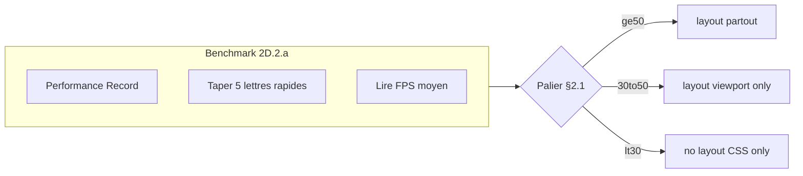

# Phase 2D — `/infractions` + `/fondamentaux` : plan détaillé (révision durcies)

> **Statut** : plan uniquement — pas d’implémentation sans feu vert explicite.  
> **Fichier** : [`docs/plans/phase_2d_infractions_fondamentaux_d1597d11.plan.md`](phase_2d_infractions_fondamentaux_d1597d11.plan.md)  
> **Versionnement** : [`.cursor/rules/plans-versioning.mdc`](../../.cursor/rules/plans-versioning.mdc) — **committer** ce fichier dès création.  
> **Rappel** : `LIGHT_MODE_ENABLED = false` ; focus trap drawer 2A **hors scope 2D**.

---

## 0. Décision code mort `src/components/fondamentaux/` — **option C** (**2026-04-20**)

Le dossier **`src/components/fondamentaux/`** (hub riche jamais branché sur la route publique) a été **supprimé** par chore dédié. Désormais le périmètre Phase **2D.1** (migration tokens) couvre uniquement :

- tout le périmètre **`/infractions`** (§1.1) ;
- la **route** `/fondamentaux` : [`page.tsx`](../../src/app/fondamentaux/page.tsx), [`[slug]/page.tsx`](../../src/app/fondamentaux/[slug]/page.tsx), [`error.tsx`](../../src/app/fondamentaux/error.tsx), et le hub **[`CoursFichesListClient`](../../src/components/cours/CoursFichesListClient.tsx)**.

**Historique / rollback** : [`DEADCODE.md`](../../DEADCODE.md) section *Historique code mort supprimé* ; `git log --all -- src/components/fondamentaux/` pour retrouver l’historique Git du dossier supprimé.

**Impact grep §1.3** : après suppression, le cumul des **7** motifs sur le périmètre 2D tombe à **132** occurrences (somme des colonnes — **112** infractions + **20** fondamentaux route/hub) ; ordre de grandeur **~130** pour la migration 2D.1 (vs **~286** avant option C).

---

## 1. Arborescence exacte des pages et composants

### 1.1 `/infractions`

| Fichier | Lignes | Rôle fonctionnel |
|---------|--------|------------------|
| [`src/app/infractions/page.tsx`](../../src/app/infractions/page.tsx) | 49 | **Server** : métadonnées dynamiques (`getInfractionsCatalog().length`), `searchParams.q` → `InfractionsPageClient` ; shell `InteriorPageShell` + Suspense. |
| [`src/components/infractions/InfractionsPageClient.tsx`](../../src/components/infractions/InfractionsPageClient.tsx) | 479 | **Client principal** : recherche, filtres par famille (`INFRACTION_FAMILY_OPTIONS`), vues liste/tableau (`ViewToggle`), groupement, cartes liste + Framer Motion déjà importé ; synchro URL (`q`, `vue`, `inf`, `focus`). |
| [`src/components/infractions/InfractionsTable.tsx`](../../src/components/infractions/InfractionsTable.tsx) | 468 | **Vue tableau** + panneaux / drawer mobile. |
| [`src/components/infractions/InfractionDetailContent.tsx`](../../src/components/infractions/InfractionDetailContent.tsx) | 234 | **Contenu fiche** (légal / matériel / moral, CTA). |
| [`src/components/infractions/InfractionDetailBubble.tsx`](../../src/components/infractions/InfractionDetailBubble.tsx) | 41 | **Overlay** bulle détail. |
| [`src/components/infractions/InfractionAudioCoach.tsx`](../../src/components/infractions/InfractionAudioCoach.tsx) | 249 | **Audio** TTS / réglages. |
| [`src/components/infractions/InfractionsFlashMode.tsx`](../../src/components/infractions/InfractionsFlashMode.tsx) | 479 | **Mode flash** (session, cartes). |
| [`src/components/infractions/ViewToggle.tsx`](../../src/components/infractions/ViewToggle.tsx) | 110 | **Bascule** vue liste / tableau. |

**Données** : catalogue via [`src/data/recapitulatif-data.ts`](../../src/data/recapitulatif-data.ts) (`getInfractionsCatalog`) — alignement contenu **160** fiches avec l’audit home déjà résolu.

### 1.2 `/fondamentaux` — route publique et hub (seul périmètre 2D)

| Fichier | Lignes | Rôle fonctionnel |
|---------|--------|------------------|
| [`src/app/fondamentaux/page.tsx`](../../src/app/fondamentaux/page.tsx) | 50 | **Hub public** : `SectionTitle` + encadré « Comment lire » + **[`CoursFichesListClient`](../../src/components/cours/CoursFichesListClient.tsx)** (`basePath='/fondamentaux'`). |
| [`src/components/cours/CoursFichesListClient.tsx`](../../src/components/cours/CoursFichesListClient.tsx) | 80 | **Grille hub** : recherche **sans debounce**, `useMemo` filtre, grille `sm:grid-cols-2`, liens vers `/fondamentaux/[slug]`. Cible 2D.1 (tokens) et 2D.4 (reveal). |
| [`src/app/fondamentaux/[slug]/page.tsx`](../../src/app/fondamentaux/[slug]/page.tsx) | 52 | **Fiche** : markdown via [`MarkdownArticle`](../../src/components/content/MarkdownArticle.tsx). |
| [`src/app/fondamentaux/error.tsx`](../../src/app/fondamentaux/error.tsx) | 44 | **Erreur** boundary (tokens `examen-`, `ds-`). |

*Ancien dossier `src/components/fondamentaux/` (composants non montés) : **supprimé** le **2026-04-20** — option **C** ; détail dans [`DEADCODE.md`](../../DEADCODE.md).*

### 1.3 Décompte grep strict §3.10 (périmètre 2D post-option **C**, **2026-04-20**)

**Motifs** (alignés [phase_2b_home_7d3a9c41.plan.md](phase_2b_home_7d3a9c41.plan.md) §1.1, + `ds-` pour tokens design system ; `orde-` — **0 occurrence** dans ces périmètres) :

- `slate-`, `examen-`, `ds-`, `bg-white`, `text-white`, `bg-gradient-`, `orde-`

**`/infractions` + composants** (9 fichiers)

| Fichier | slate- | examen- | ds- | bg-white | text-white | bg-gradient- | orde- |
|---------|--------|---------|-----|----------|------------|--------------|-------|
| `src/app/infractions/page.tsx` | 0 | 0 | 0 | 0 | 0 | 0 | 0 |
| `InfractionsPageClient.tsx` | 13 | 0 | 10 | 3 | 1 | 2 | 0 |
| `InfractionsTable.tsx` | 0 | 0 | 0 | 10 | 5 | 3 | 0 |
| `InfractionDetailContent.tsx` | 11 | 0 | 0 | 5 | 2 | 6 | 0 |
| `InfractionDetailBubble.tsx` | 2 | 0 | 0 | 0 | 0 | 1 | 0 |
| `InfractionAudioCoach.tsx` | 12 | 0 | 0 | 0 | 0 | 1 | 0 |
| `InfractionsFlashMode.tsx` | 0 | 0 | 0 | 8 | 12 | 2 | 0 |
| `ViewToggle.tsx` | 0 | 0 | 0 | 1 | 2 | 0 | 0 |
| **Sous-total infractions** | **38** | **0** | **10** | **27** | **22** | **15** | **0** |

**`/fondamentaux` — route + hub uniquement** (fichiers §1.2)

| Fichier | slate- | examen- | ds- | bg-white | text-white | bg-gradient- | orde- |
|---------|--------|---------|-----|----------|------------|--------------|-------|
| `src/app/fondamentaux/page.tsx` | 1 | 0 | 0 | 0 | 1 | 0 | 0 |
| `[slug]/page.tsx` | 0 | 0 | 0 | 0 | 0 | 0 | 0 |
| `error.tsx` | 0 | 1 | 6 | 1 | 2 | 0 | 0 |
| `CoursFichesListClient.tsx` | 5 | 0 | 0 | 2 | 1 | 0 | 0 |
| **Sous-total fondamentaux (route + hub)** | **6** | **1** | **6** | **3** | **4** | **0** | **0** |

**Total cumulé (infractions + fondamentaux §1.2)** : slate- **44**, examen- **1**, ds- **16**, bg-white **30**, text-white **26**, bg-gradient- **15**, orde- **0** — **132** occurrences cumulées sur les **7** motifs.

**Note `MarkdownArticle`** : non inclus ici ; si les fiches `[slug]` entrent dans le périmètre token 2D.1, ajouter une ligne au rapport grep de la vague.

---

## 2. Contraintes techniques spécifiques 2D

| Attendu | Technique précisée |
|---------|-------------------|
| **Grille ~160 cartes + filtres** | **`AnimatePresence`** + **`motion.div`** ; stratégie **`layout`** selon **§2.1** (mesure FPS, pas intuition). |
| **Filtres par famille** | État React + `matchesInfractionFamily` — pas de lib. |
| **Debounce recherche 150 ms** | Hook debounce **150 ms** **ou** `useDeferredValue` — documenter le choix dans le commit **2D.2.a**. |
| **Tags crime / délit / contravention** | Bordures **`ij.*`** — `border-ij-danger` / `border-ij-primary` ou `border-ij-accent` / `border-ij-border` — valider [`tailwind.config.ts`](../../tailwind.config.ts). |
| **« Je maîtrise »** | `localStorage` clé `opj-infractions-maitrise-v1` ; hydratation safe (cf. 2B). |
| **Grille fondamentaux — reveal** | `IntersectionObserver` natif ; `prefers-reduced-motion` → pas d’animation. |
| **CLS filtres** | `min-height` conteneur grille / placeholder stable. |

### 2.1 Règle de fallback **layout** Framer (paliers chiffrés)

Après benchmark **§5.1** sur la branche **2D.2.a** :

| FPS moyen (timeline pendant l’action §5.1) | Stratégie `layout` |
|-------------------------------------------|-------------------|
| **≥ 50** | `layout` sur **toutes** les cartes filtrables encore rendues. |
| **30–50** | `layout` **uniquement** sur cartes **dans le viewport** (fenêtrage via `IntersectionObserver` / rootMargin). |
| **&lt; 30** | **Pas** de `layout` Framer : **AnimatePresence** pour apparition/disparition + **transitions CSS** légères ; filtres instantanés côté motion. |

Le palier applicable est **celui mesuré**, pas une décision à l’implémentation sans chiffre.

---

## 3. Baseline Lighthouse

### 3.1 Fichiers (avant 2D.1)

| Fichier | URL |
|---------|-----|
| [`docs/baselines/phase-2d/lighthouse-before-2d-infractions.json`](../../docs/baselines/phase-2d/lighthouse-before-2d-infractions.json) | `/infractions` |
| [`docs/baselines/phase-2d/lighthouse-before-2d-fondamentaux.json`](../../docs/baselines/phase-2d/lighthouse-before-2d-fondamentaux.json) | `/fondamentaux` |

### 3.2 Protocole + **garde-fou `meta.commit`** (leçon 2B.2.3)

- **Médiane 3 passes** mobile (plan 2B §3.2.1) ; structure `meta` + `desktop` / `mobile` + `mobilePasses` si besoin.
- **`meta.commit`** = hash **`git rev-parse HEAD`** au moment exact de la capture.
- **Après chaque export JSON** : exécuter `git rev-parse HEAD` et **comparer** au champ `meta.commit`.
  - Si **incohérence** → fichier baseline **invalide** → **remesurer** avant de versionner.
- **Documenter** dans le **message de commit** qui accompagne le fichier baseline : log de vérification du type  
  `meta.commit == $(git rev-parse HEAD)` **OK** (hash abrégé).

### 3.3 Non-régression LCP

Règle **+10 % max** sur médianes (after-2d vs before-2d), comme 2B.

### 3.4 Conditions de mesure

Reprendre §3.3–3.5 du plan 2B (`npm run build` + `npm run start`, desktop + mobile).

---

## 4. Découpage en vagues (1 commit par vague / sous-vague)

| Vague | Contenu | Critère de sortie |
|-------|---------|-------------------|
| **2D.1** | Migration **iso-visuelle** `ij.*` sur **§1.1 + §1.2** ; rapport grep §3.10 ; **aucune** animation nouvelle. | Tests verts ; grep chiffré. |
| **2D.2.a** | **[`InfractionsPageClient.tsx`](../../src/components/infractions/InfractionsPageClient.tsx) uniquement** : grille, **AnimatePresence**, filtres, **debounce**, **tags** ; benchmark **§5.1** puis application **§2.1**. | 1 commit ; rollback isolé. |
| **2D.2.b** | **[`InfractionsTable.tsx`](../../src/components/infractions/InfractionsTable.tsx) seul**. | 1 commit. |
| **2D.2.c** | **`InfractionsFlashMode.tsx` + `InfractionAudioCoach.tsx` + `InfractionDetailContent.tsx` + `InfractionDetailBubble.tsx`**. | 1 commit. |
| **2D.3** | « Je maîtrise » + `localStorage`. | e2e + hydratation OK. |
| **2D.4** | Hub fondamentaux : **IntersectionObserver** sur **[`CoursFichesListClient`](../../src/components/cours/CoursFichesListClient.tsx)** (grille markdown). | reduced-motion OK. |
| **2D.5** | `lighthouse-after-2d-*.json` + comparaison médianes ; **§3.2** sur chaque fichier. | Gate LCP. |

**Split 2D.2** : **obligatoire** — **trois commits atomiques** (a / b / c), chacun testable et réversible indépendamment.

---

## 5. Risques et points de vigilance

### 5.1 Protocole benchmark FPS — grille / recherche (**2D.2.a**)

1. Ouvrir **Chrome DevTools** → onglet **Performance**.
2. Cliquer **Record** (ou `Ctrl+E`).
3. **Action standardisée** : dans le champ recherche infractions, **taper rapidement 5 lettres** (ex. `volvo` ou séquence fixée documentée dans le commit).
4. Arrêter l’enregistrement après stabilisation du rendu.
5. Sur la **timeline** : lire le **FPS moyen** pendant la fenêtre temporelle de l’action (pas le cold load initial).
6. **Décision** : appliquer le palier **§2.1** correspondant ; si doute, refaire **3 enregistrements** et prendre la **médiane**.

### 5.2 Autres points

- **CLS** : `min-height` / placeholder (§2).
- **Hydratation `localStorage`** : même recette que 2B.
- **`prefers-reduced-motion`** : pas de `layout` animé ; filtres instantanés.
- **e2e** : [`e2e/infractions.spec.ts`](../../e2e/infractions.spec.ts) + [`e2e/fondamentaux.spec.ts`](../../e2e/fondamentaux.spec.ts) — axe + clavier.
- **Coupling chiffres** : aligner assertions avec `getInfractionsCatalog` (leçon 55+/160).

---

## 6. Règles de travail

- Pas d’Agent sans feu vert du plan.
- Commits atomiques + rapport grep par vague.
- Tests verts obligatoires.
- `LIGHT_MODE_ENABLED` reste `false`.
- Focus trap drawer : hors scope.

---

## 7. Dettes connexes

- Fiches `[slug]` + **`MarkdownArticle`** : si hors périmètre grep 2D.1, traiter en vague ultérieure ou audit ciblé.
- Recherche hub **sans debounce** — alignement UX optionnel avec `/infractions` (2D.4 / quick win).
